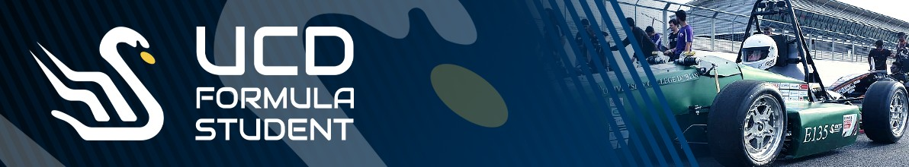

  
  <h1>🏎️ UCD Formula Student 🏎️</h1>
  
  

UCD Formula Student is a team of passionate students from University College Dublin who are dedicated to designing, building and racing an electric car at the Formula Student UK competition. Our mission is to promote engineering excellence and innovation in the field of motorsports. 

We're Ireland's first electric Formula Student team. Our members hail from all year groups and a range of disciplines such as engineering, science, humanities, and business. With a focus on education, technology, and diversity and inclusion, we want to bring sustainable electric vehicles to everybody.  

### 🥳 Follow Our Socials 🥳
Find us on [Instagram](https://www.instagram.com/ucdformulastudent/) and [Facebook](https://www.facebook.com/ucdfs/)!

### 📧 Contact Us 📧
Get in touch with us via the contact page on our [website](https://ucdfs.ie/contact-us)